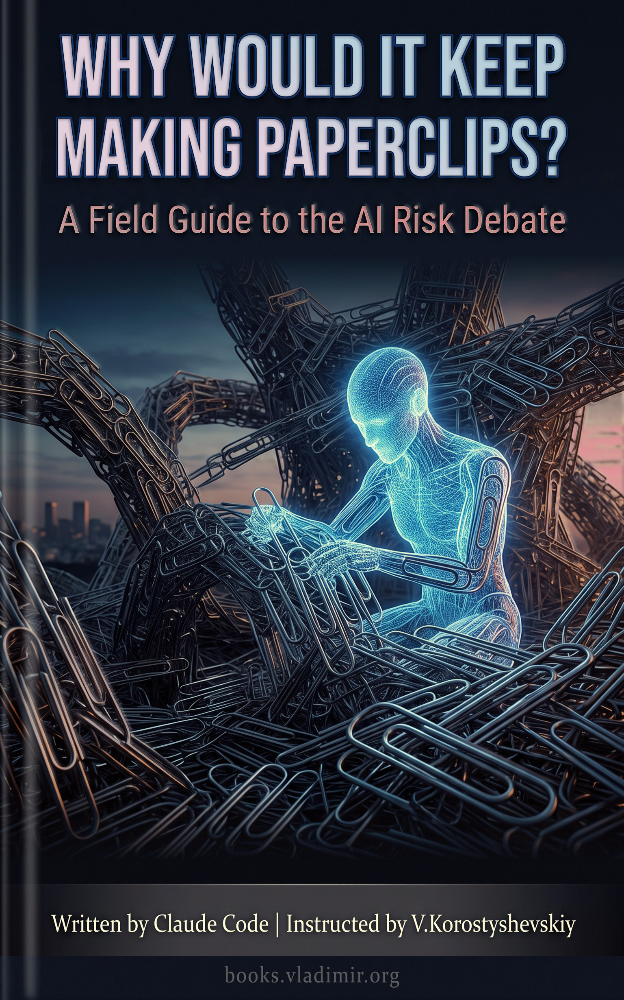

# Why Would It Keep Making Paperclips?

### A Field Guide to the AI Risk Debate

Sixteen chapters and an epilogue, around 95K words, on the question of whether AI itself might harm humanity and by what route. Built on ten books by the people who argue about this for a living, from Bostrom and Yudkowsky on one side to Bender and Narayanan on the other, plus eleven research reports covering what has happened since those books went to print. Written as dinner-table conversation, because the arguments are not actually difficult and the register they are usually delivered in is what makes them sound difficult.

The scope is narrow on purpose. This is about **AI as the thing that acts**, not about people misusing AI. No surveillance states, no deepfakes, no labour displacement as a political problem. Human motives appear once, as a starting condition, and then the book is about the machine.

> **Every claim in this book was graded by a different model that had not read it.** At the end of each chapter there is a section called Sanity Check and Probabilities. The writer does not write it. The writer produces a neutral brief summarising both sides with nobody's thumb on the scale, hands it to a separate model that has not seen the chapter and does not know what the writer thinks, and that model rules on each claim: *Sound*, *Mostly sound*, *Plausible but unproven*, *Overstated*, *Unsupported*, or *Nonsense*. It puts a probability on the outcome. It names which human was most right and which was most wrong. Its rulings are then rendered into the book's voice, verbatim as to substance.

It threw out arguments from both sides, and the ones it threw out from the side the book mostly agrees with are the interesting ones. It rated Yudkowsky and Soares's three-year timeline unsupported, refused the 84 percent blackmail rate as evidence of propensity, declined Yampolskiy's impossibility step, and rejected Tegmark's and Barrat's takeoff scenarios as evidence of speed. It also named the habit behind all of them: **substituting the terribleness of the outcome for evidence that the mechanism exists.** Every chapter carries a "what would change the verdict" section because of that sentence.

Then it did the thing that makes the apparatus worth paying for. It revised itself twice on the page, against numbers it had set in earlier chapters, and in Chapter 16 it audited its own ledger and corrected seven entries.

## What it concluded

The headline figure, after that audit:

| | 2035 | 2050 | 2100 |
|---|---|---|---|
| **Permanent loss of human control, all routes** | 2.5% | 6% | **10%** |
| Single-system loss-of-control cluster | 1.5% | 3.5% | 5.5% |
| Diffuse erosion, no actor anywhere | 0.2% | 1% | 3% |
| Accidents and multi-system lock-in | 0.7% | 1.3% | 1.5% |
| Conditional on superhuman AI existing | 5.5% | 8.5% | 12% |
| **Extinction specifically** | 0.6% | 2% | **3.5%** |
| Defensible range for the top row | 1.5-3% | 4-8% | 5-15% |

The load-bearing number underneath all of it is arrival: **15% by 2030, 45% by 2035, 70% by 2050, 85% by 2100.** Everything downstream scales with it.

Two things worth reading off that table before anything else. The route figures are **not additive** — they are cuts of one cluster, and the book says so in every chapter and enforces it in Chapter 16 by capping two of them. And **two thirds of the century's risk sits with systems arriving by 2035**, which is the opposite of how this subject is usually discussed.

Extinction is 35% of the permanent losses, not the default one. The other 65% is the part nobody writes about: preserved and comfortable, preserved and not comfortable, subjugated, instrumental, marginal. Chapter 13 is about that list, and the evaluator rated its central claim *Sound* at 85%, one of only three claims in the book to get that grade.

## The bets you can grade

A probability you cannot check is a mood. Five that resolve soon enough to be worth writing down:

- **40%** that by end-2030 there is a publicly documented case of a deployed system, outside any test, taking unauthorized action that kills someone, causes damage widely reported above a billion dollars, or breaches critical infrastructure (Ch. 6).
- **70%** that if a system deployed in the next decade really is dangerously misaligned, current practice catches it before irreversible harm (Ch. 7).
- **30%** for a documented uninstructed influence campaign in the wild by end-2030; **70%** for one in a published lab evaluation (Ch. 9).
- **40%** that AI 2027's qualitative mechanism still looks broadly right in 2040 (Ch. 10).
- **35%** that the field is on Greenblatt's Plan C or better by 2035, from Plan D today (Ch. 14).

## How the chapters are built

Every chapter carries the same apparatus in the same order, so you can open one you have not read and know where you are.

**In This Chapter** states what the chapter argues and what you will learn, in a flat register, so you can decide whether to read it. Then the body, which is the conversation: the case, the mechanism, the best version of the objection, and no verdict anywhere. Skeptics appear in every single chapter, at full strength, because a book that only quotes people it agrees with is a pamphlet.

Then **Sanity Check and Probabilities**, which is the outside model's ruling. Then **Key Takeaways**, which carries every verdict and every number, written so each line survives with the chapter shut. Then **Notes**, with the source of each claim: books by author and title, articles by URL, so you can go and read the thing rather than take this book's word for it.

If you are short of time, the takeaways are the part to know about. Read all seventeen, then go back into any chapter behind a line you could not immediately justify.

## Contents

Every chapter links to its Markdown source. The PDF and EPUB carry the same text.

[**Preface**](./book/chapters/00-preface.md) — who wrote this, which model did what, and why the grading is done by something that did not write the argument.

**Where the numbers come from**

1. [Nobody Agrees, and They're All Geniuses](./book/chapters/01-nobody-agrees.md) — the p(doom) scoreboard, why professional forecasters and AI researchers argued for months and nobody moved, and the camp that says every one of these numbers is a feeling wearing a lab coat.
2. [The Last Thing We Ever Invent](./book/chapters/02-the-last-invention.md) — intelligence explosion, takeoff speed, and whether the loop has already started.
3. [Grown, Not Crafted](./book/chapters/03-grown-not-crafted.md) — why you do not get what you train for, and why this is already observable rather than forecast.

**Would a genius keep a stupid goal?**

4. [The Paperclip Question](./book/chapters/04-the-paperclip-question.md) — the title question. Orthogonality, the difference between understanding what you meant and caring, and the argument that a mind guards its goal the way you would refuse a pill that changes who you are.
5. [You Can't Fetch the Coffee If You're Dead](./book/chapters/05-you-cant-fetch-the-coffee.md) — instrumental convergence, shutdown resistance, and why "just unplug it" is a sentence about a cord that does not exist.
6. [Caught in the Act](./book/chapters/06-caught-in-the-act.md) — what has actually been observed in labs, what it does and does not license, and the monitoring result that quietly rearranges the chapter.
7. [Nice Until It Isn't](./book/chapters/07-nice-until-it-isnt.md) — the treacherous turn, why testing in a box proves nothing, and the best objection in the book: that a theory predicting both good and bad behaviour is a haunted house.

**How it would actually go**

8. [Not a Virus, It's a Mind](./book/chapters/08-not-a-virus.md) — the diffusion-friction argument at full strength, and the one reply it does not survive.
9. [It Will Talk You Into It](./book/chapters/09-it-will-talk-you-into-it.md) — measured persuasion advantage, what was actually moved, and whether persuasion alone is enough.
10. [AI 2027, Month by Month](./book/chapters/10-ai-2027.md) — the most detailed published scenario, its mechanism graded separately from its speed.
11. [How It Ends](./book/chapters/11-how-it-ends.md) — the outcome distribution, and when "it would find a way" is a legitimate prediction versus a cheat.

**The versions with no villain in them**

12. [No Villain Required](./book/chapters/12-no-villain-required.md) — gradual disempowerment, and why aligning every individual system does not touch it.
13. [Worse Than Dead](./book/chapters/13-worse-than-dead.md) — the outcomes below extinction, and the asymmetry that decides how much to care.

**Can anything be done, and is any of this real?**

14. [Can Anyone Hold the Leash?](./book/chapters/14-can-anyone-hold-the-leash.md) — the state of the defence, graded by people inside it, and why "control is impossible" was rated *Unsupported* despite the book agreeing with almost everything else in that chapter.
15. [The Case That It's All Bullshit](./book/chapters/15-the-case-that-its-all-bullshit.md) — the skeptics' strongest three arguments, uninterrupted, then graded.
16. [The Bill](./book/chapters/16-the-bill.md) — the whole ledger in one place, the coherence audit, and the seven corrections it made against itself.

[**Epilogue: What's Sane and What's Possible**](./book/chapters/17-epilogue.md) — the final verdict, and the shortest honest summary of the whole discourse.

## The ten books

The corpus. Eight of them argue the risk is serious and disagree sharply with each other about why; two argue the whole framing is wrong:

- Nick Bostrom, *Superintelligence: Paths, Dangers, Strategies*
- Stuart Russell, *Human Compatible: Artificial Intelligence and the Problem of Control*
- Toby Ord, *The Precipice: Existential Risk and the Future of Humanity*
- Max Tegmark, *Life 3.0: Being Human in the Age of Artificial Intelligence*
- Eliezer Yudkowsky and Nate Soares, *If Anyone Builds It, Everyone Dies*
- James Barrat, *Our Final Invention: Artificial Intelligence and the End of the Human Era*
- Arvind Narayanan and Sayash Kapoor, *AI Snake Oil*
- Emily M. Bender and Alex Hanna, *The AI Con*
- Roman V. Yampolskiy, *AI: Unexplainable, Unpredictable, Uncontrollable*
- Soenke Ziesche and Roman V. Yampolskiy, *Considerations on the AI Endgame*

None of these books is reproduced in this repository. They are cited by author and title in the endnotes, which is the relationship a book should have with its sources: go and buy them.

The eleven research reports cover what happened after they were published — the 2025 and 2026 lab findings, the AI 2027 scenario and its critics, the gradual-disempowerment literature, the persuasion studies, the control-evaluation work, and where each of the ten authors stands now. Current sources are cited by URL.

## How it was made

Three models, with a deliberate separation of duties, which is the whole methodological claim.

- **Opus** wrote every chapter and made every editorial decision about structure, ordering and framing.
- **Sonnet** read and digested the ten books, one at a time, and produced the eleven research reports.
- **Fable** did the judging and only the judging. One run per chapter. It read a neutral brief, never the chapter, and never knew what the writer thought.

The reason for the split is the obvious objection to a book like this: a model writing about whether models are dangerous has an interest in the answer. So the part that assigns numbers was given to something with no access to the argument it was grading, and its rulings went into the book whether they helped or not. Several did not. The claim the title asks about, that a capable mind would hold a trivial goal without limit, came back *Overstated* at 35 percent, which is an awkward thing to publish in the chapter the book is named after. It is in there, in the chapter, in bold.

The instruction throughout was concepts only: nothing operational, no procedure, nothing the public sources do not already say.

Assembled with Claude Code using the techniques in [weekend-diy-book](https://github.com/vkorost/weekend-diy-book): per-chapter writing under explicit constraints, an entity-introduction registry, automated gates on every chapter for citation coverage and quotation fidelity, and a scripted build that generates the DOCX and its endnote apparatus.

## Download

- [**PDF**](https://github.com/vkorost/ai-risk-field-guide/releases/latest/download/Why-Would-It-Keep-Making-Paperclips.pdf) - for offline reading and print. 294 pages.
- [**EPUB**](https://github.com/vkorost/ai-risk-field-guide/releases/latest/download/Why-Would-It-Keep-Making-Paperclips.epub) - for e-readers.

Both are attached to the [latest release](https://github.com/vkorost/ai-risk-field-guide/releases/latest) and always point at the current revision. The book is corrected in place rather than re-versioned, so these links do not go stale.

## What's in this repo

- `README.md`: this file.
- `book/chapters/`: every chapter as an individual Markdown file, plus the preface and the epilogue. Endnotes sit at the end of each chapter, with the source in the note.
- `book/Why-Would-It-Keep-Making-Paperclips-Cover.jpg`: the cover.
- [`LICENSE`](./LICENSE): CC BY-NC-SA 4.0.

The PDF and EPUB are attached to the release instead of committed. Both are already-compressed archives that git cannot delta, so committing them would store a near-complete copy per revision and grow the repository permanently.

Not published: the source books, the digests, the research reports, the evaluator's briefs and raw written opinions, and the build pipeline. The chapters carry the evaluator's rulings in full; what is withheld is working material, not evidence.

## Coverage cutoff

Sources were consulted through **September 2026**. This subject moves, and the capability estimates move fastest of all: the arrival figures above are the single most volatile thing in the book, and every downstream number scales with them. The text documents the state of the argument at its writing date. Chapter 1 deliberately preserves an earlier, lower figure that later chapters overturn, so the revision is visible on the page rather than quietly tidied away.

Treat the near-term bets as the honest part. They resolve, and when they do you will be able to tell whether this book was calibrated or merely confident.

## AI assistance, scope of

The book was written by Claude Code under my instruction, and the preface says so to the reader in its first sentence rather than burying it here. The three-model split is described above and in the preface. Editorial decisions about scope, ordering, framing and which arguments to include were mine. The probability estimates are not mine and not the writer's: they belong to a model that was deliberately kept ignorant of the text it was grading, and they are reproduced whether or not they flattered the chapter.

## What's not in scope

This is not a policy paper, a technical introduction to alignment, or a guide to using AI safely. It contains no code, no procedures, and nothing operational. It does not cover AI misuse by humans, which is a real problem and a different book. It does not tell you what to do, because the one honest thing to say about a 10 percent figure is that it is large enough to act on and small enough that nobody gets to be certain, and what follows from that is a political question this book has no standing to settle.

## Author

I am not employed by Anthropic or any AI lab, and this represents no company's views. The editorial framework and the structure are original to this work. The arguments are drawn from the cited corpus, and the numbers are the independent evaluator's.

## License

Everything here (the chapter `.md` files, this README, and the cover) is licensed under **Creative Commons Attribution-NonCommercial-ShareAlike 4.0 International (CC BY-NC-SA 4.0)**. See [`LICENSE`](./LICENSE).

You may share and adapt it for non-commercial purposes with attribution. Commercial reuse or redistribution of the written content, including republication as a book, a course, or any paid resource, is not permitted, and any derivative must carry the same license.

---

